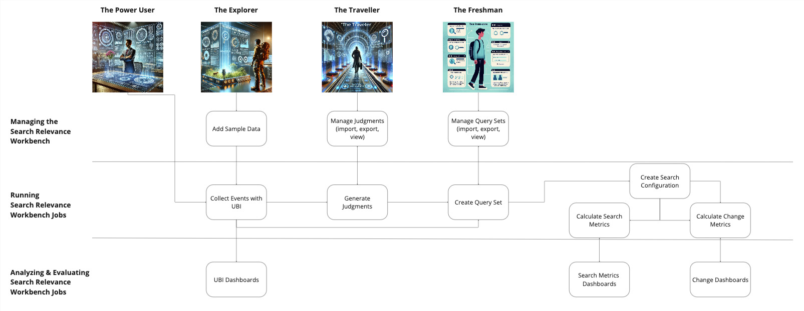

# Mockups for the Search Relevance Workbench

## User Journey's
We have identified four key user journeys: the power user, the explorer, the traveler, and the freshman.

***The Power User:*** The power user to be the user that really leverages and uses all the different features and capabilities the search relevance workbench offers. So from collecting events with ubi, generating judgments from these collected events, creating query sets from these, and all the different evaluation and analysis capabilities.

***The Explorer***:  Maybe the explorer just read an opensearch blog post announcing the search relevance workbench, or he just wants to. Well, tinker, with all the different features it offers.  So the explorer is not really interested in hooking all the different bits and pieces up with his or her platform, but rather import sample data and then take it from there. So exploring everything without production data, but rather with fake sample data.

***The Traveler:*** The traveler, may be someone who already is on the journey of improving search. Relevant search result, quality. Someone who may already have judgments. So you have customers that already have judgments. You have customers that may already have a query set. So how do we enable these? So we we offer them ways of importing what they already have, so that they can use what they what they did in the past and build upon this foundation.

***The Freshman:*** Lastly, we have the freshman. The freshman does not have UBI. He does not have any kind of judgments, but he has a search application, and he wants to know what will happen if I turn on hybrid search, for example, or what happens when I go from a hundred percent vector search based application to a hybrid search application. So the freshman wants to explore the impact of an idea that he or she has in mind to improve search relevance without having user behavior data, without having judgments. So he takes it from, let's say, a simpler less metrics driven perspective.

## The Story:

> Eric Says: As you go through the story, right click and open the links in a new window ;-).

[Landing Page](./01_search_relevance_landing_page.html)
is the landing page for Search Relevance Workbench.

The Freshman is going to be very interested in the quick comparison features for algorithems.

They will gravitate to the the ability to quickly [compare a query](./30_query_comparison.html), with enhanced metrics.  They will appreciate the RBO and other metrics, and the ability to eyeball the results.

At some point they will start thinking "but wait, I want a set of queries", and they will want to create a _Query Set_. They will of course be able to upload a CSV file of queries.  However if they are more adventurous, like the Power User, then they will take advantage of the [Query Sampling](./21_manage_query_sets_creation.html) capablity to build the query set using best practices for sampling _query sets_. 

Regardless of if they manually upload the queries or sample them from UBI, they now are ready to compare the [lists of queries](./32_search_result_list_comparison.html) against the multiple algorithms iva the _Search Configuration_'s.   

Pick two _Search Configurations_'s and the _Query Set_ and they can quickly [compare the lists of queries against each other](./33_search_quality_eval_job_detail_view.html), still using list based metrics like Jaccard and RBO.

We have slightly glossed over where the _Search Configuration_ is created.  Since they are just a grouping of existing features of OpenSearch, creating one is [quite simple](./34_create_search_config.html).  It's just a query or a query template, and optionally a pipeline.

Eventually they are going to want to bring in more quality oriented evaluation metrics.  Fortunantly we can source the data we need for measuring search quality from a number of places.

First off, if they already have Human labeled Judgements (and it's close cousin "Ground Truth via LLM" judgements, then they can easily [just import them](./41_import_judgments.html) into SRW.  Maybe someday we'll have a built in labeling capablity built in?

However, if they are the Power User or the Explorer, AND are interested in digging into the abilty to [generate Judgements directly](./42_generate_judgments.html) from the user click data that that has been gathered then they will want to enable UBI.  Potentially here would be an option to "Load Sample UBI data"?

[UBI Landing page](./10_ubi_landing.html) is there first stop.  They then configure the 
[UBI indexes](./12_ubi_indexes.html) needed and assuming they have set up UBI event collection (using the OpenSearch Ingestion Blueprint or directly), then they are now recieving UBI data that is being ingested.

Immediately they can use some of the default [Dashboards](./14_ubi_dashboards.html) to start understanding what the users are doing.  An Explorer will can click _Add Sample User Behavior Data_ to jumpstart and then start working with the UBI dashboards, to decide if they want to use it.  A Traveller may actually have UBI type data in their own homegrown analytics that they want to import directly into OpenSearch to take advantage of the Dashboards, which they can by using APIs.

Eventually they will be able to set up the SRW to perform _Evaluation Runs_ on a regular timed basis, and they will build up a picture of search quality over time, but consulting the list of [previous runs](./35_search_quality_eval_job_overview.html)

## Inventory of Mockups

**01_x: Global Pages**

* [01_search_relevance_landing_page.html](./01_search_relevance_landing_page.html) is the landing page for SRW.

**10_x: UBI**

* [10_ubi_landing.html](./10_ubi_landing.html) is the configuration page for setting up UBI.
* [12_ubi_indexes.html](./12_ubi_indexes.html) is with the indexes set up and user click data being recieved.
* [14_ubi_dashboards.html](./14_ubi_dashboards.html) is the basic dashboards that ship with UBI.

**20_x: Query Sets**

* [20_manage_query_sets.html](./20_manage_query_sets.html) shows an overview of all existing query sets
* [21_manage_query_sets_creation.html](./21_manage_query_sets_creation.html) is when you want to create a new query set

**30_x: SQEF**

* [30_query_comparison.html](./30_query_comparison.html) shows a single query comparision.
* [32_search_result_list_comparison.html](./32_search_result_list_comparison.html) shows the set up of a comparison.
* [33_search_quality_eval_job_detail_view.html](./33_search_quality_eval_job_detail_view.html) shows the results of comparing a _Query Set_ with two _Search Configuration's_.
* [34_create_search_config.html](./34_create_search_config.html) is about creating a _Search Configuration_.
* [35_search_quality_eval_job_overview.html](./35_search_quality_eval_job_overview.html) lists all the _Evaluation Runs_ that have been performed.

**40_x: Judgments**

* [41_import_judgments.html](./41_import_judgments.html) is all about importing _Judgements_
* [42_generate_judgments.html](./42_generate_judgments.html) lets you generate _Judgements_ from Click Data.

**50_x: Hybrid Search Optimizer**

tbd

## Other Notes

We really should have something for Hybrid Optimizer.

Format the code after `npm install prettier` via: `prettier --write ubi_landing.html`
